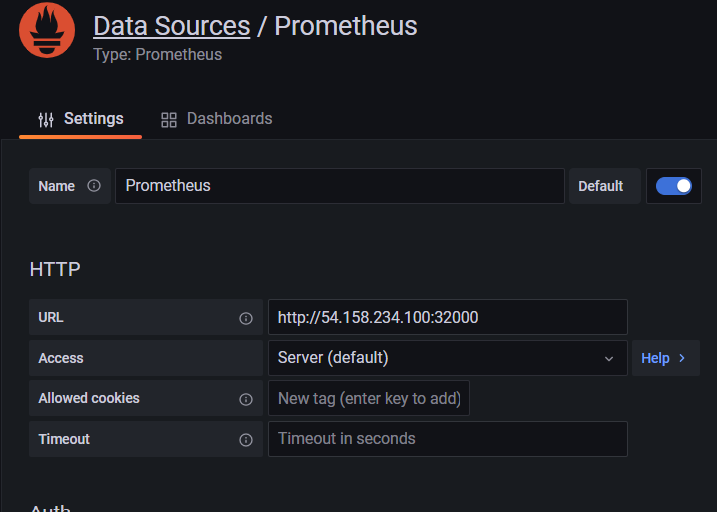
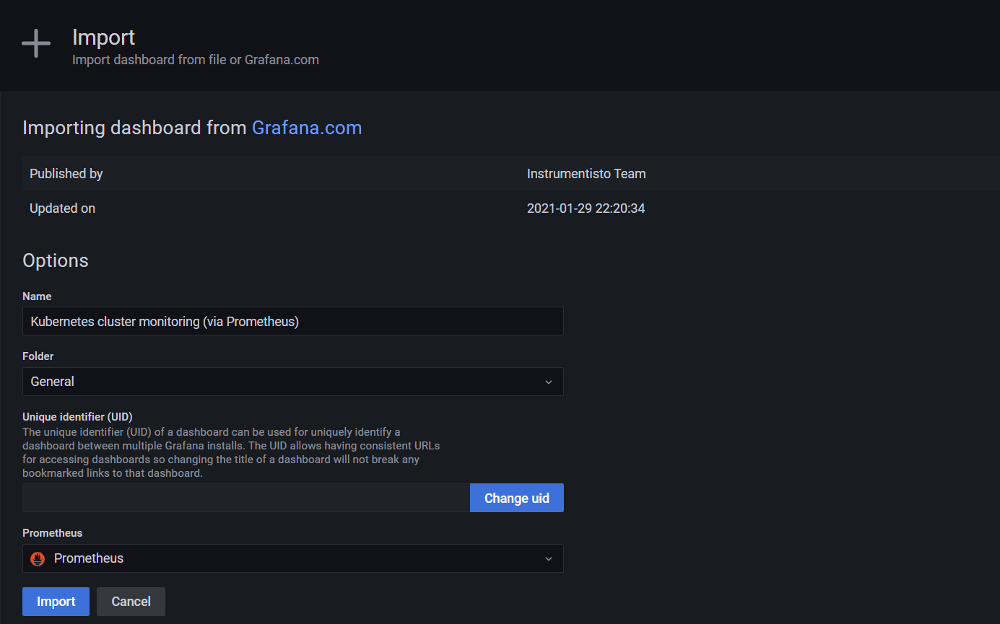
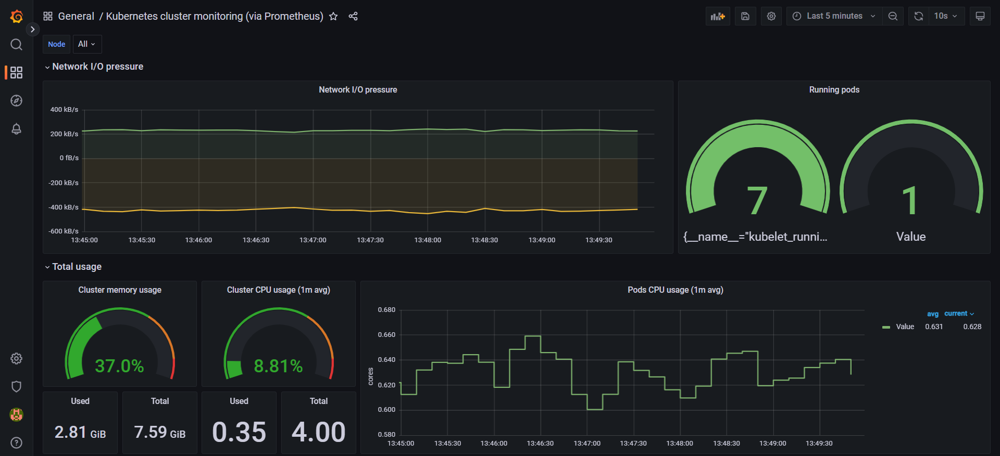
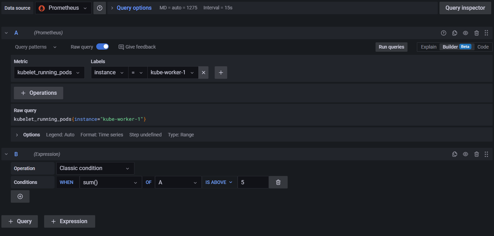
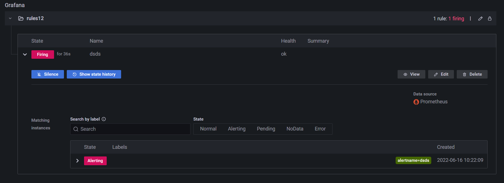

# Hands-on Prometheus & Grafana-01: Monitoring Kubernetes

Purpose of the this hands-on training is to give students the knowledge of basic operations for monitoring Kubernetes cluster.

## Learning Outcomes

* Learn deployment of Prometheus to Kubernetes cluster
* Learn how to monitor with Prometheus
* Learn how to create a monitoring dashboard with Grafana

## Outline

- Part 1 - Launching a Kubernetes cluster

- Part 2 - Deploying Prometheus server 

- Part 3 - Monitoring with Prometheus WebUI

- Part 4 - Creating a monitoring dashboard with Grafana 

 

<h2>Importing the data -> public-ip:port </h2>

-----
 
<h2>Importing the dashboard</h2>

------
 
<h2>The dashboard</h2>

------
 
<h2>Adding a panel to the dashboard named Running pods</h2>

-----
 
<h2>Rule added to the metric</h2>

